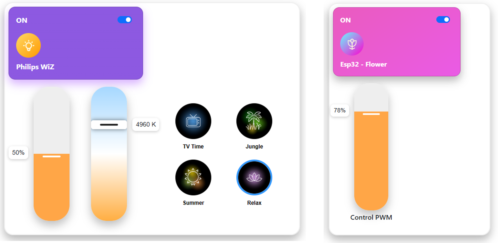
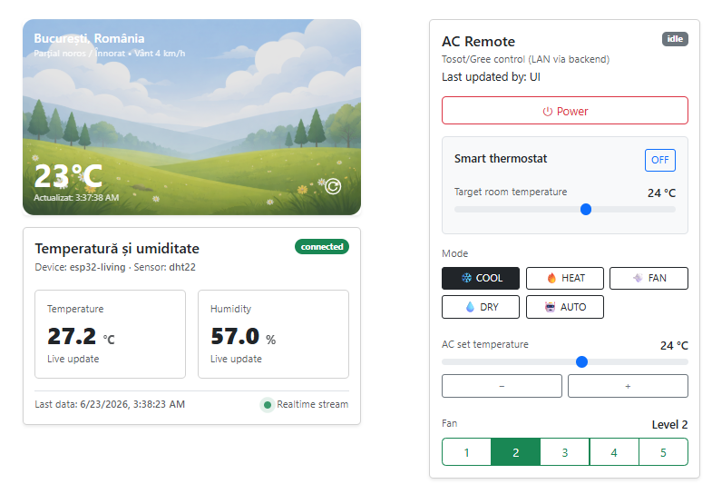
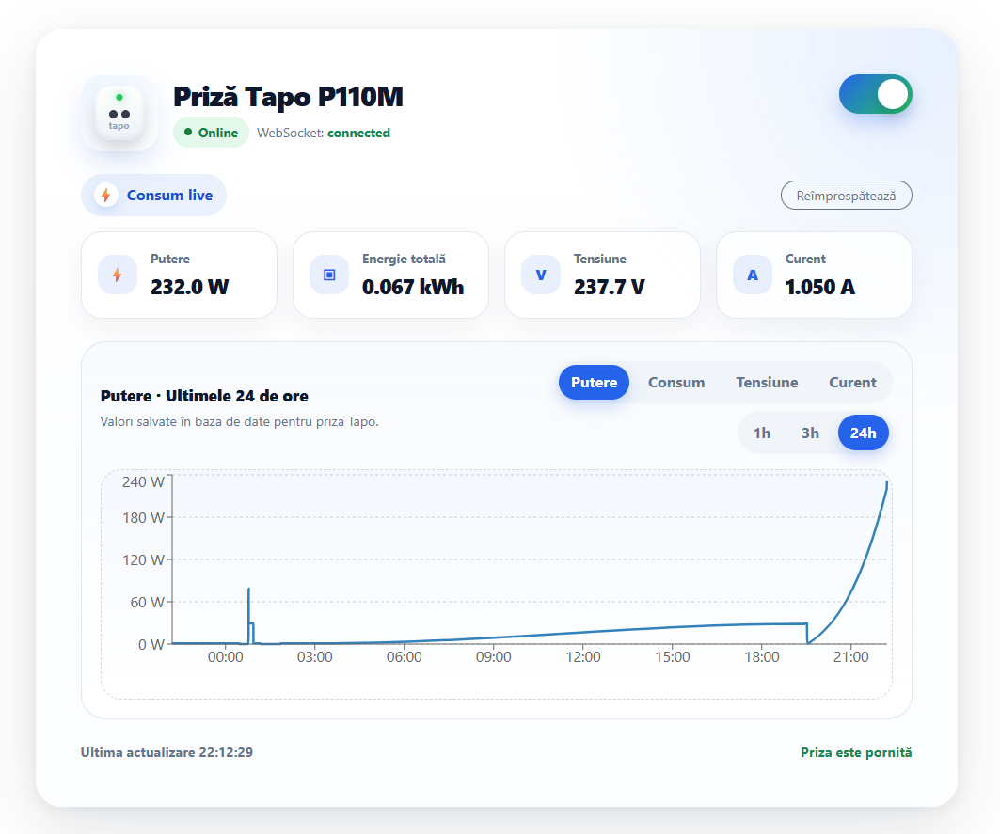
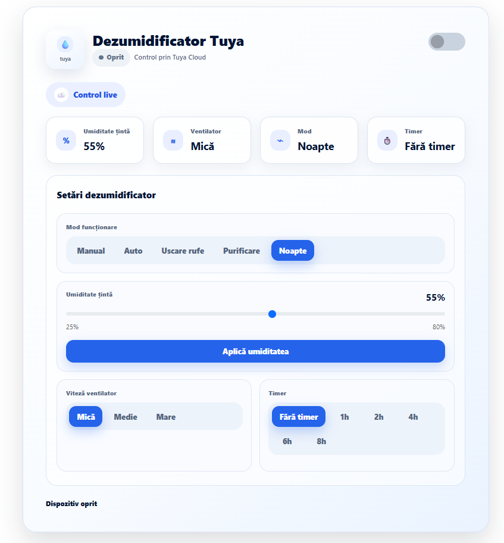
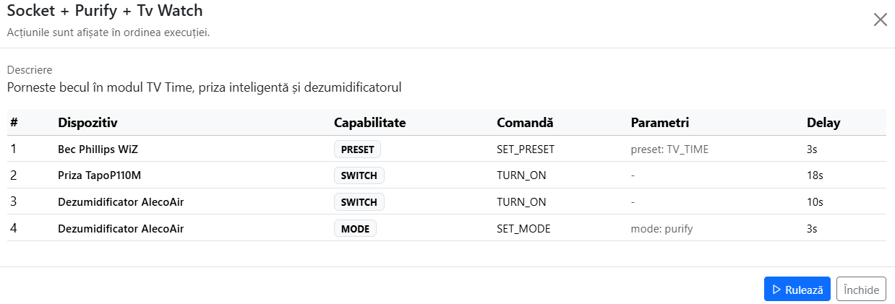
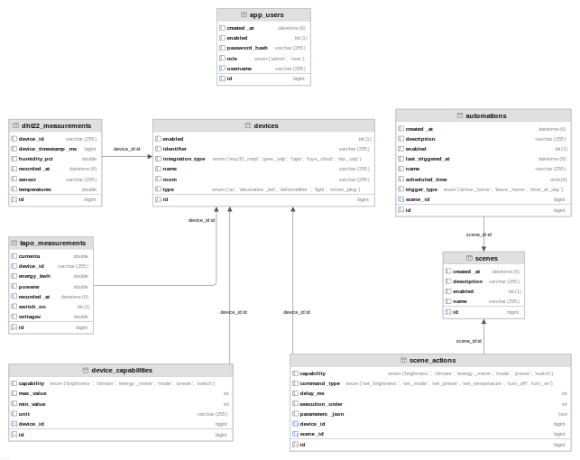

# Smart Home Platform

Platformă Smart Home dezvoltată în cadrul lucrării de disertație, având ca scop monitorizarea, controlul și automatizarea dispozitivelor inteligente dintr-o locuință prin intermediul unei aplicații web.

Sistemul integrează dispozitive IoT dezvoltate pe baza microcontrolerului ESP32, echipamente comerciale și servicii cloud într-o arhitectură modulară bazată pe Spring Boot și React. Comunicarea dintre componente utilizează protocoale precum MQTT, WebSocket, UDP și metode HTTP REST, oferind sincronizare în timp real și control centralizat al dispozitivelor.

Pe lângă funcționalitățile clasice de control și monitorizare, platforma implementează un sistem inteligent de climatizare bazat pe analiza temperaturii ambientale și algoritmi de filtrare și predicție, precum și integrarea unor servicii externe precum Tuya IoT și Home Assistant pentru integrarea dispozitivelor compatibile Matter.

---

## Funcționalități principale

- Control în timp real al iluminatului inteligent WiZ.
- Controlul aparatului de aer condiționat prin protocol UDP.
- Termostat inteligent bazat pe algoritmi de filtrare și predicție.
- Monitorizarea temperaturii și umidității folosind senzori DHT22 conectați la ESP32.
- Controlul prizelor inteligente și monitorizarea consumului energetic.
- Integrarea unui dezumidificator prin platforma Tuya IoT.
- Automatizări și scenarii configurabile pentru controlul simultan al mai multor dispozitive.
- Actualizarea instantanee a interfeței prin WebSocket și STOMP.
- Comunicare MQTT între dispozitivele ESP32 și backend.
- Automatizări mobile prin iOS Shortcuts și geofencing.
- Acces securizat la platformă prin Tailscale VPN.

---

## Arhitectura aplicației

Platforma este organizată pe o arhitectură distribuită în care aplicația React comunică exclusiv cu backend-ul Spring Boot prin intermediul API-urilor REST și al conexiunilor WebSocket. Backend-ul reprezintă punctul central al sistemului, gestionând autentificarea utilizatorilor, comunicarea cu baza de date, schimbul de mesaje MQTT cu dispozitivele ESP32, controlul dispozitivelor locale prin UDP și integrarea serviciilor externe precum Tuya IoT.

  

---

## Interfața aplicației

Aplicația este organizată pe module independente, fiecare fiind dedicat unei categorii de dispozitive sau funcționalități.

### Control iluminare

**Controlul becului inteligent WiZ**:

- reglarea luminozității
- reglarea temperaturii de culoare
- moduri si scene de iluminat
- pornire/oprire

**Controlul LED-urilor fără controller integrat** - realizat prin modificarea PWM-ului semnalului de comanda al tranzistorului

  

---

### Climatizare și monitorizare parametrii ambientali

Telecomandă pentru aparatul de aer condiționat și termostat pentru activarea modulului de automatizare a climatizării pe baza temperaturii ambientale.
Afișarea în timp real a datelor de temperatură și umiditate colectate de senzorul DHT22 și transmise de microcontroller-ul ESP32 prin protocolul de mesagerie MQTT.

  

---

### Prize inteligente

Controlul prizelor inteligente și monitorizarea parametrilor electrici.

  

---

### Dezumidificator

Controlul unui dezumidificator comercial integrat prin platforma Tuya IoT.

  

---

### Scenarii pentru automatizare

Crearea și executarea unor scenarii care controlează simultan mai multe dispozitive.

  

---

## Automatizarea inteligentă a climatizării

Una dintre funcționalitățile principale ale proiectului este implementarea unui termostat software inteligent care utilizează datele provenite de la senzorul DHT22 pentru controlul automat al aparatului de aer condiționat.

Procesul de decizie este împărțit în mai multe etape succesive:

- Filtrarea temperaturilor utilizând algoritmul de **medie mobilă**.
- Estimarea evoluției temperaturii pe termen scurt prin **regresie liniară**.
- Controlul pornirii și opririi utilizând **hysteresis**.
- Limitarea comutărilor frecvente prin impunerea unor timpi minimi de funcționare și standby.

Aceste mecanisme reduc influența zgomotului introdus de senzor, evită pornirile și opririle repetate ale aparatului și permit anticiparea modificărilor de temperatură înainte ca acestea să producă disconfort utilizatorului.

---

## Structura bazei de date

Persistența datelor este realizată folosind MySQL prin intermediul Spring Data JPA și Hibernate. Baza de date gestionează utilizatori, dispozitive, măsurători provenite de la senzori, scenarii, evenimente și configurațiile necesare funcționării aplicației.

  

---

## Tehnologii utilizate

| Componentă    | Tehnologii                             |
| ------------- | -------------------------------------- |
| Backend       | Java 17, Spring Boot                   |
| Frontend      | React, TypeScript                      |
| Baza de date  | MySQL                                  |
| ORM           | Spring Data JPA, Hibernate             |
| IoT           | ESP32, DHT22                           |
| Comunicare    | MQTT, WebSocket, STOMP, UDP, HTTP REST |
| Autentificare | Spring Security, JWT                   |
| Cloud         | Tuya IoT                               |
| Acces remote  | Tailscale VPN                          |
| Build         | Maven                                  |

## Autor

**Octavian Teodor Dobre**

Proiect realizat în cadrul lucrării de disertație – **Platformă Smart Home pentru controlul și automatizarea dispozitivelor casnice**.
